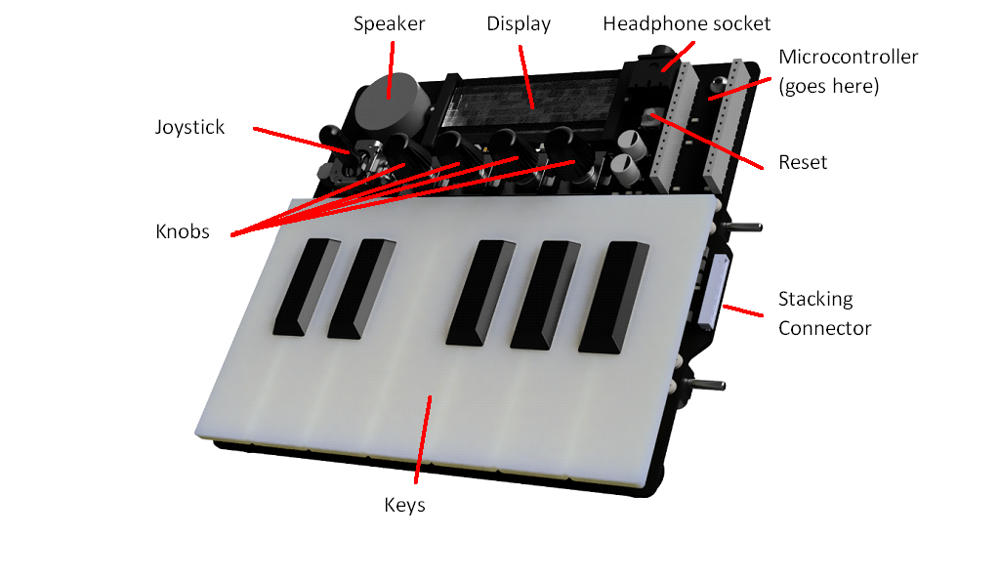

# Embedded Systems: Synthesiser

## Intro

A second year group project for a module on Embedded Systems.\
The goal was to write all the practical code for a synthesiser that stacks with other synths, 
including for keypress detection, noise generation, communication, etc.

The synthesiser uses an `ST NUCLEO-L432KC` board, running an `STM32L432KCU6U` processor, with an `ARM Cortex-M4` core.

    

(details courtesy of @edstott)

For more details on the board itself and the basic features that we implemented, the [getting started](docs/getting_started/) section of the `docs`, also courtesy of @edstott, does a good job of explaining everything.

## What we accomplished

Over the span of the coursework, we completed all the basic features (such as basic noise generation and simple communications), so we started implementing more and more _advanced_ features, primarily: 
- An [actual UI](docs/report/UI.md)
- [Multiple Octaves](docs/report/octaves.md)
- [Alternate Timbres](docs/report/tones.md) (primarily Sine)
- [Polyphony](docs/report/polyphony.md) (playing more than one note at a time)
- A [Metronome](docs/report/Metronome.md)
- Among other features

More details regarding any of the implemented features can be found in our coursework [report](docs/report/).

## Evaluation

### UI/UX

asdjf;d

### Noise Generation (& Volume)

asdfasdf

### Octaves & Polyphony

asdf

### Metronome

asdf

### Communications

asdf

### Playback

asdf

### Codebase

ummm...

## Improvements

### Codebase

<!-- TODO: write sth after implementing -->

### Communications

<!-- TODO: write sth after implementing -->

### Noise Generation (Volume)

<!-- TODO: write sth after implementing -->

### UI/UX

<!-- TODO: write sth after implementing -->

### Envelope

Actually, another _advanced_ feature: this is one we didn't have time to implement during the project. 

<!-- TODO: write sth after implementing -->

### Playback

<!-- TODO: write sth after implementing -->

<!-- -------------------------- END OF SECTION -------------------------- -->

<!-- Sth. about how this, of course, isn't perfect and whatnot, but that this is now a project that works and I'm happy with? -->

## TODOs (-> Improvements)

Things that I wanted to improve on after the coursework deadline:

0. Write more in this README :p
1. Break this code into a properly structured project
2. Implement functional and scalable communications
   - current communication protocol is lackluster and buggy, to say the least
   - 8-bit, on/off stuff, implement main/sub, dominance establishment protocol
3. Fix tone volumes, due to the nature of the waveforms (and maybe gen.), some sound a lot quieter
4. Improve UI, remove bugs, improve readability, make note display uniform
5. Implement sound enveloping (toggled by volume knob)
6. Integrate Playback feature (MITeo21's branch)
7. More stuff?
